# Hooked

A web app to log and track climbing projects by grade, style and completion status.

## 🛠️ Built With

- [SvelteKit](https://kit.svelte.dev/)
- [Tauri](https://tauri.app/)
- [MongoDB Atlas (Cloud)](https://www.mongodb.com/cloud/atlas)
- [Cloudinary](https://cloudinary.com/)
- [Vite](https://vitejs.dev/)

## 🚀 Getting Started

Follow these steps to run the project locally.

### 1. Clone this repository

```bash
git clone https://github.com/vee-b/hooked.git 
cd hooked
```

### 2. Install dependencies

```bash
npm install
```

### 3. Run the development server (Tauri)

```bash
npm run tauri dev
```

> ⚠️ Requires **Node.js v18+** and **npm v8+**

### To check your versions:

```bash
node -v
npm -v
```

## 📸 Screenshots

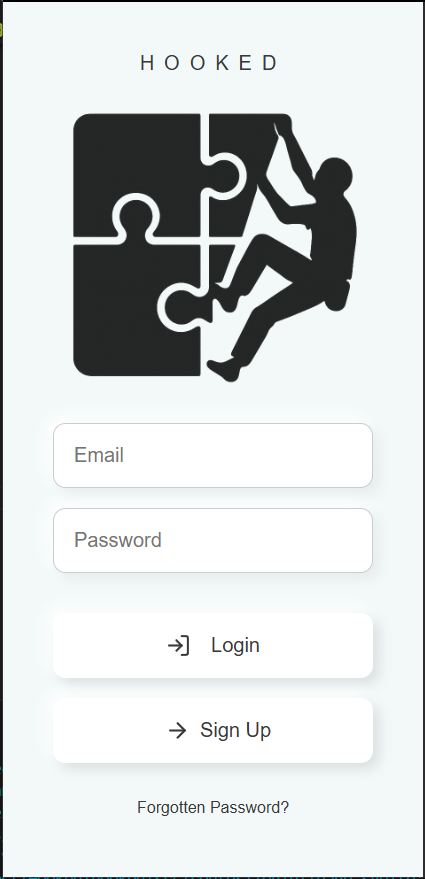  

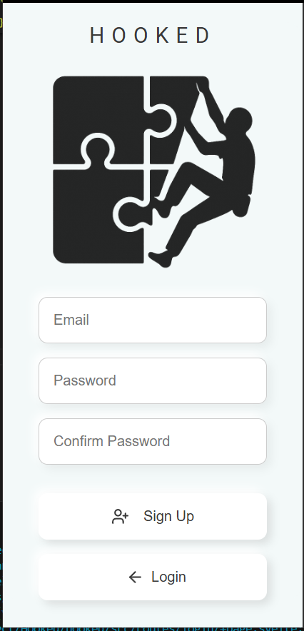  

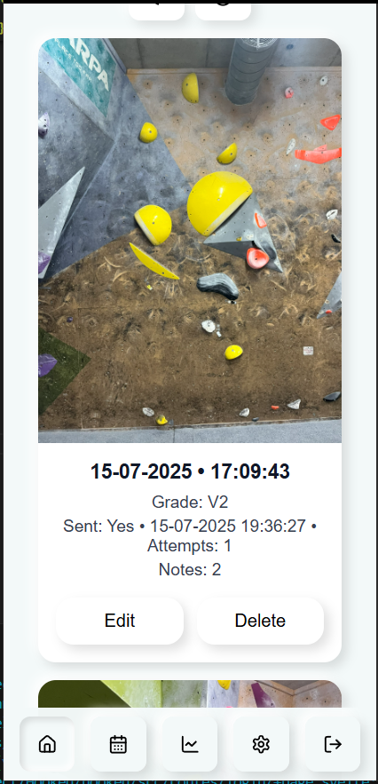  

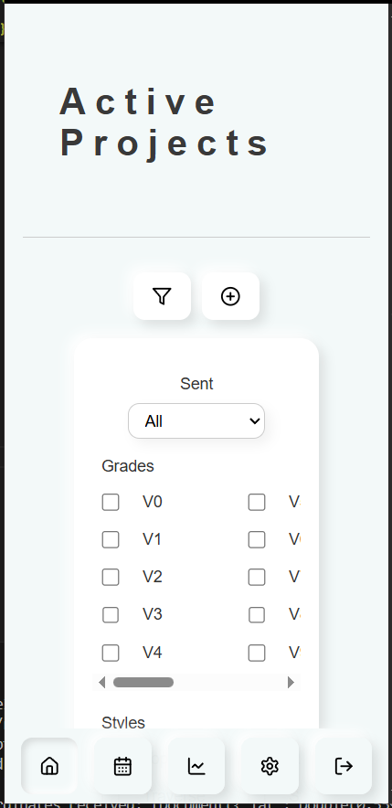  

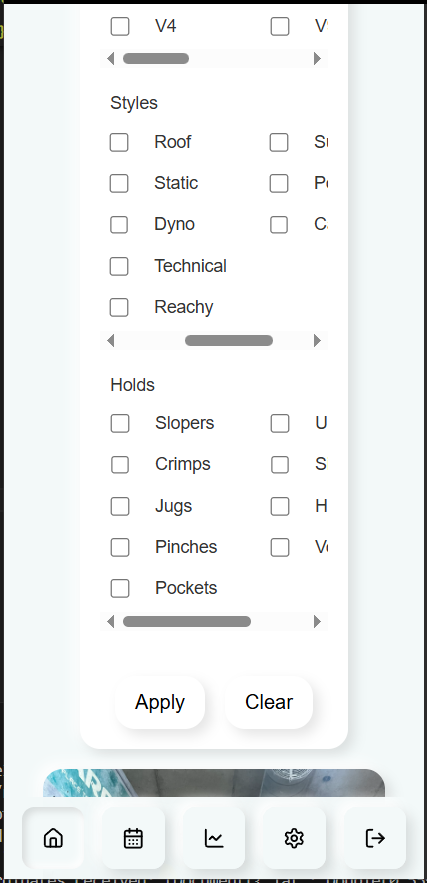  

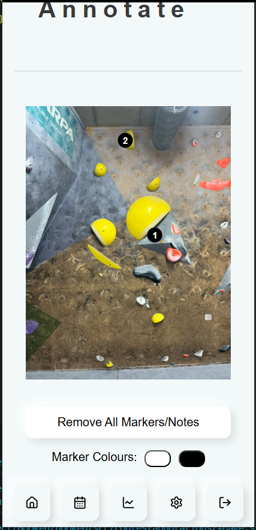  

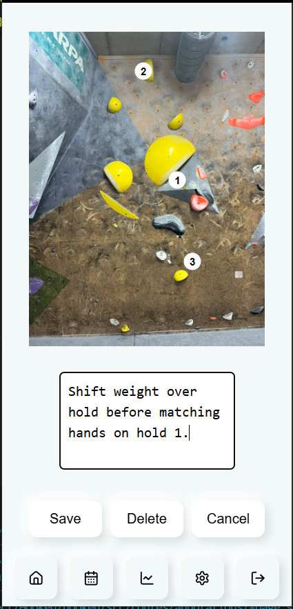  

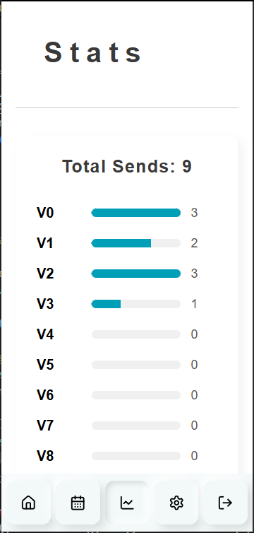  

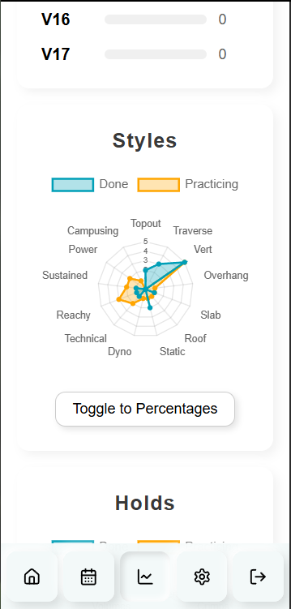  

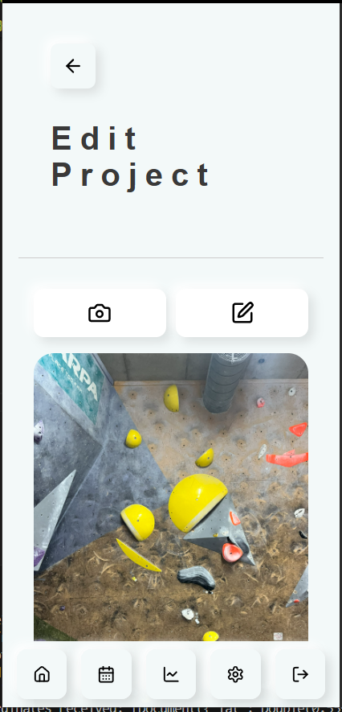  

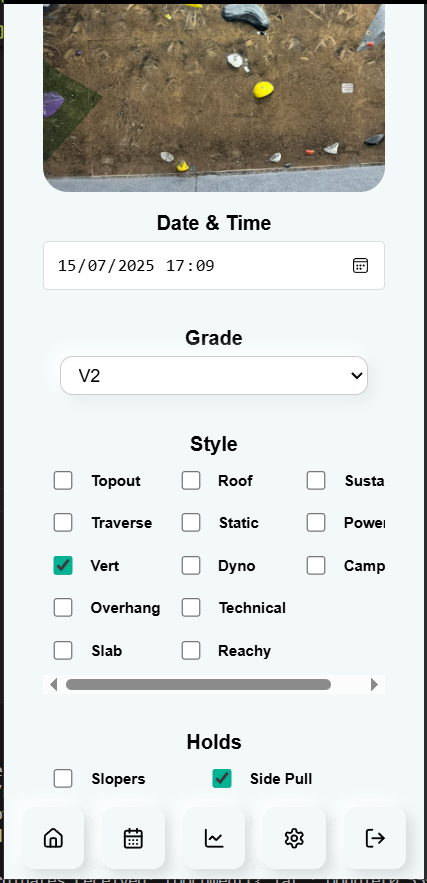  

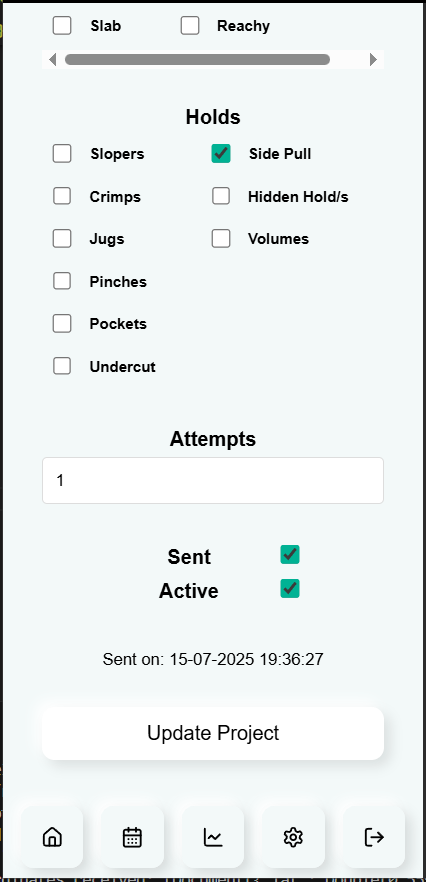  


**Note:** This project was created as part of my personal portfolio and is not open to external contributions at this time.
